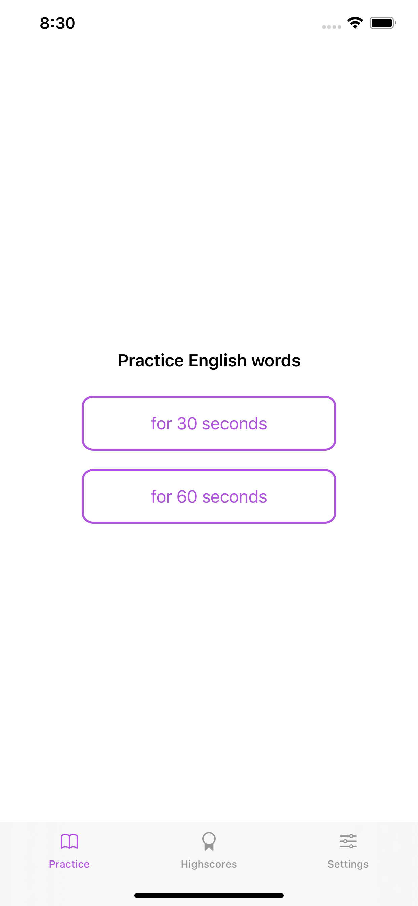
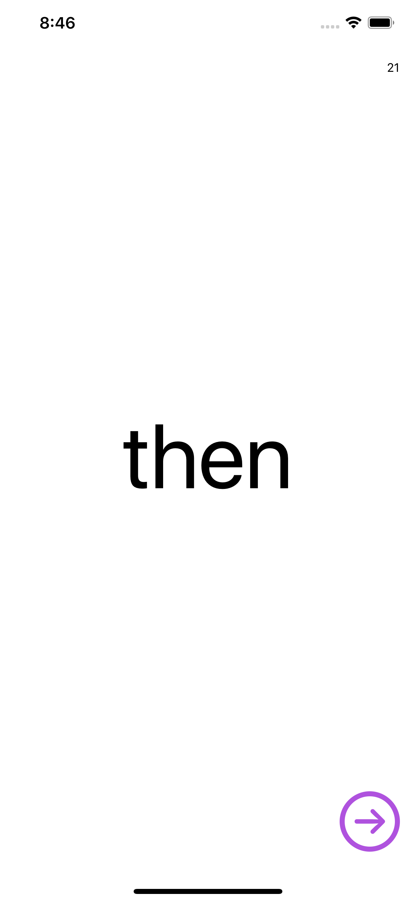
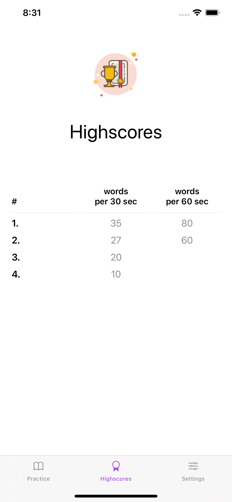
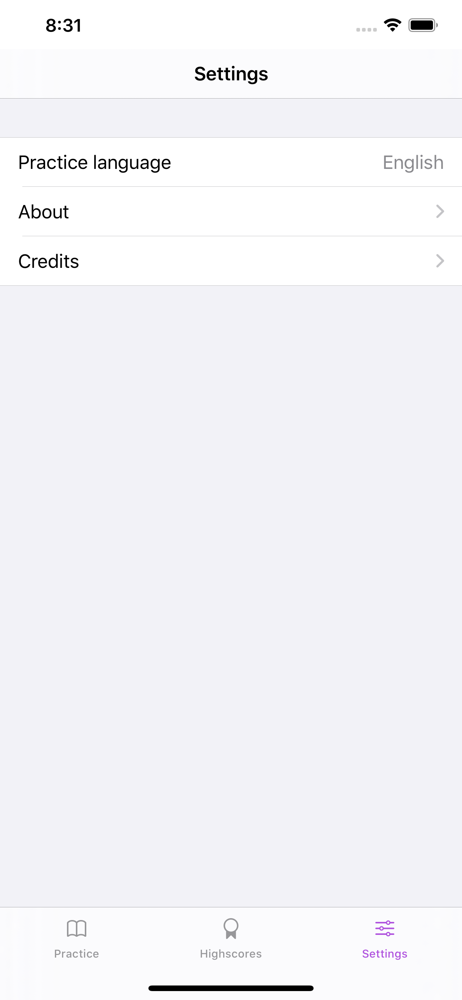
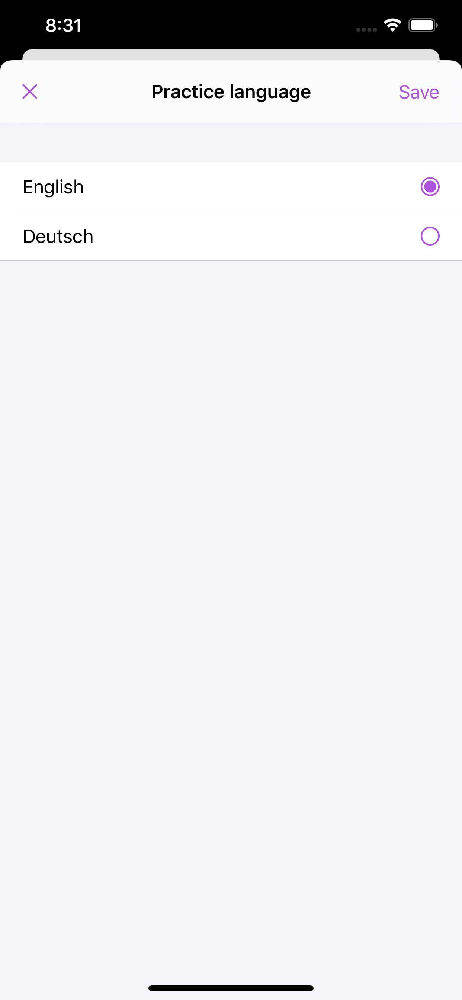

# Blitz Read

The app helps to practice and track the number of sight words kids can read.

When children make the first steps in reading, one of the techniques they can acquire is to learn how to read sight words.
Those are commonly used words that a reader can memorize and recognize as a whole without the need to split words into syllables.

## How to use

1. Pick a practice duration.
2. Let a kid read a word out loud, then move to the next word. Iterate.
3. Check high scores screen to see the progress over time.
4. (Optional) Choose another language for practice from the list of available languages.

